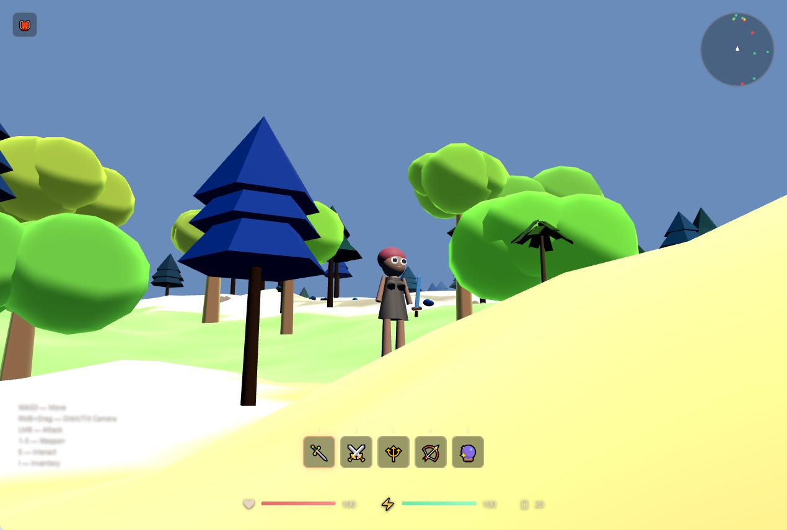
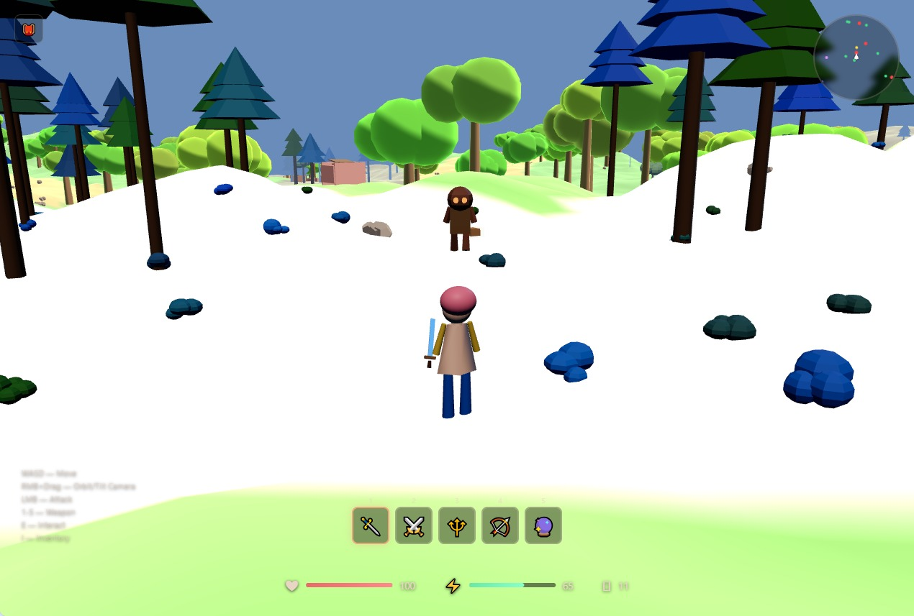
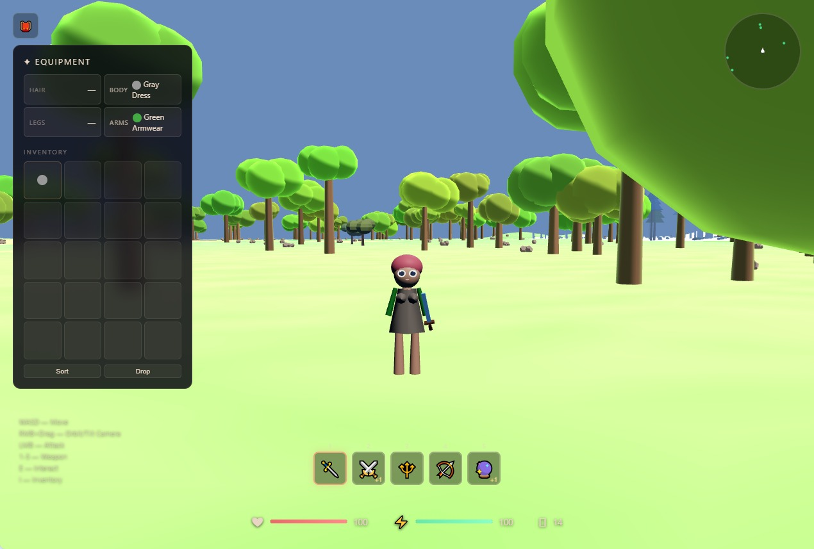

# ECHOBOUND

**Open-World Action-RPG** — a third-person roguelike built with Three.js.

You are a wandering female knight in an infinite procedural world. Fight monsters, open treasure chests, collect weapons, and survive.





## Features

- Infinite procedural world with multiple biomes
- Third-person camera (RMB drag to orbit)
- Cel-shaded monsters with 5 tiers + bosses
- 6 weapon types: Sword, Greatsword, Polearm, Bow, Catalyst, Dagger with upgrade system
- Treasure chests with loot (weapons, coins, healing, clothes)
- Interactive wardrobe system for the heroine
- Collectable loot for healing (apples, shrooms)
- Sound system
- Minimap

## How to Run

```
npm install
npx vite --host
```

Open `http://localhost:3000` in a browser.

## Controls

WASD — move  
RMB + drag — orbit camera  
Left click — attack  
A / D — rotate camera (when not moving)  
E — interact (open chests)  
I — toggle inventory  
1–5 — switch weapon
M - toggle minimap

## Project

Built in ~2 hours as a solo dev experiment with Three.js procedural generation.
